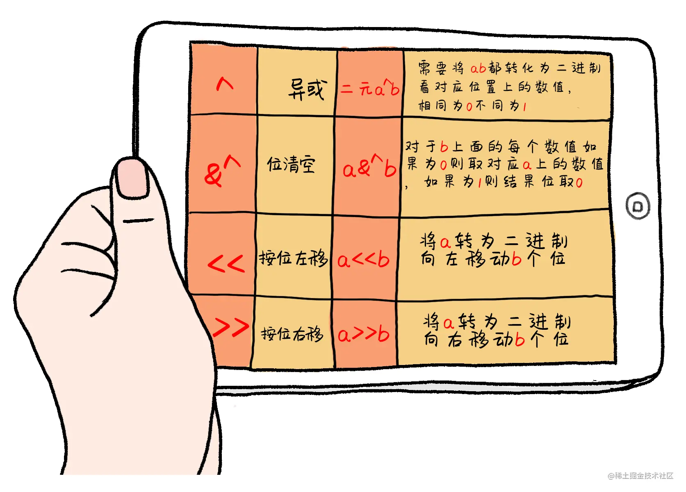

# 02_基本类型与运算符

## 基本类型


### bool

> 布尔类型，只有`true`或`false`两个值,占用一个字节的内存

::: code-group

```go
    a,b := true,false
```

:::

### 整型

| 数据类型    | 说明         | 取值范围                                     |
|---------|------------|------------------------------------------|
| 有符号整数 | |  |
| int8    | 有符号 8位整数  | -128到 127                               |
| int16   | 有符号 16位整数 | -32768 到32767                           |
| int32 | 有符号 32位整数 | -2147483648到2147483647                   |
| int64 | 有符号 64位整数 | -9223372036854775808到9223372036854775807 |
| 无符号整数 | |  |
| uint8   | 无符号8位整数   | 0到255                                   |
| uint16  | 无符号16位整数  | 0到65535                                 |
| uint32  | 无符号32位整数  | 0到4294967295                            |
| uint64 | 无符号64位整数   | 0到18446744073709551615                  |

::: code-group

```go
// byte is an alias for uint8 and is equivalent to uint8 in all ways. It is
// used, by convention, to distinguish byte values from 8-bit unsigned
// integer values.
type byte = uint8

// rune is an alias for int32 and is equivalent to int32 in all ways. It is
// used, by convention, to distinguish character values from integer values.
type rune = int32
```

:::

::: tip
> 如上，字节类型`byte = uint8` 类型，`rune = int32`,这段代码可以在`src/builtin/builtin.go`中找到
:::

### string

> 字符串的概念就是多个byte的集合，一个字符序列用双引号""，或者`` (esc下面的键) 表示。

::: code-group

```go
name := "xianren"
x := 'A'
fmt.Printf("类型%T\n", name) // string
fmt.Printf("类型%T", x) // int32
// 通过len函数可以查看字符串的长度，也可以通过索引获取对应位置的ascall码值
fmt.Println(len(name), name[2]) //7 ，97
```

:::

> 单引号包裹的一般为字符类型，即`rune`,但通过索引从字符串获取到的是`byte`类型，通过`len()`获取的也是`byte`的个数,而不是我们看到的字符的个数，如下例子

::: code-group

```go
name := "李二"
fmt.Println(len(name)) // 6
```

:::

::: tip
go语言字符串使用utf-8编码，一个中文字符需要三个字节来表示,所以在含有非ascall码字符时，不要直接从字符串中通过索引获取字符,可以将它转化成字符数组来获取
:::

::: code-group

```go
name := '李二'
list := []rune(name)
fmt.Println(list) // [26446 20108]
```

:::

### float

| 单精度 浮点类型 |  | 取值范围 |
| --- | --- | --- |
| float32 | 负数时 | -3.402823E38 到 -1.401298E-45 |
| float32 | 正数时 | 1.401298E-45 到 3.402823E38 |

| 双精度 浮点类型 | 取值范围 |
| --- | --- |
| float64 | -1.79E+308 到 +1.79E+308 |

#### 单精度双精度两者区别

> 1. 在内存中占有的字节数不同
> 单精度浮点数在机内占4个字节。
> 双精度浮点数在机内占8个字节。
> 2. 有效数字位数不同
> 单精度浮点数 有效数字7位。
> 双精度浮点数 有效数字16位。
> 3. 使用情况区别
> 一般用来表示美元和分的时候用单精度类型。
> 超出人类经验的数字函数，例如 sin() cos() tan() sqrt() 都使用双精度值。

### 类型转换

> go 语言是静态语言，要求，定义、赋值、 运算、类型一致才能进行操作。所以要进行操作的时候必须保证数据类型一致。需要注意的是，只有兼容的数据类型才能够转换。 强制类型转换的语法 `Type(value)`

数值间转换
::: code-group

```go
    var a int8 = 22
    var b int16 = 44
    var c = b - int16(a) // 类型一致时才能运算
    fmt.Println(c)
```

:::

浮点型转整型

::: code-group

```go
    d := 3.345

    fmt.Println(int(d)) // 3 只保留整数部分
```

:::

> 与字符串之间的互相转换，在下一节会讲到

::: tip

这里没有介绍复数类型

:::

## 运算符

### 算术运算符

> 程序在运行过程中执行数学运算时候需要算数运算符。

| 运算符 | 描述 | 说明 |
| --- | --- | --- |
| + | 表示相加 | 5+2 =7 |
| - | 相减 | 5-2 =3 |
| * | 相乘 | 5*2 =10 |
| / | 相除 取商 | 5/3 = 1 |
| % | 相除 取余数 | 5%3= 2 |
| ++ | 自身加1 | 5++ =6 |
| -- | 自身减1 | 5-- =4 |

### 关系运算符

> 关系运算符的结果是bool类型的

| 运算符 | 描述 | 说明 |
| --- | --- | --- |
| == | 比较相等 | 10==10 结果 true |
| != | 比较不等 | 10 !=10 结果 false |
| 是否大于 |  | 100>1 结果 true |
| < | 是否小于 | 100<1 结果 false |
| >= | 大于等于 | 100>=100 结果 true |
| <= | 小于等于 | 100>=101 结果 false |

### 逻辑运算符

| 标识符 | 描述 | 说明 |
| --- | --- | --- |
| && | 逻辑与 | 操作数都为真才为真 有一个为假就为假（一假则假，全真为真） |
| II | 逻辑或 | 操作数有一个为真就为真（一真为真，全假为假） |
| ! | 逻辑非 | 相反方向则为真（假为真 真为假） |

### 位运算符



### 赋值运算符

| 运算符 | 描述 |
| --- | --- |
| = | 把等号右侧的数值 赋给左边的变量 |
| += | 自身加上后面的值 再赋给左边的变量 |
| -= | 自身减去后面的值 在赋给左边 |
| /= | 自身除后面的值 再赋值给左边 |
| %= | 自身与后面的值求余数后 再赋值给左边 |
| <<= | 左移后再赋值 |
| >>= | 右移后再赋值 |
| &= | 按位与后再赋值 |
| I= | 按位或 后再赋值 |
| ^= | 按位异或后再赋值 |

### 占位字符

> 占位符表示在程序中输出一行字符串时候，或者格式化输出字符串的时候使用。go内置包fmt中Printf方法可以在控制台格式化打印出用户输入的内容。fmt.Printf("%T",x)

| 占位符 | 说明 | 举例 | 输出 |
| --- | --- | --- | --- |
| %d | 十进制的数字 | fmt.Printf("%d",10) | 10 |
| %T | 取类型 | b :=true fmt.Printf("%T",b) | bool |
| %s | 取字符串 | s :="123" fmt.Printf("%s",s) | 123 |
| %t | 取bool类型的值 | b:=true fmt.Printf("%t",b) | true |
| %p | 取内存地址 | p :="123" fmt.Printf("%p", &p) | 0xc0000461f0 |
| %b | 二进制的数字 | fmt.Printf("%b",5) | 101 |

::: tip
注意: go语言中也有`++`,`--`,这两个运算符,但它们与c系语法不同,只能位于变量后,且是语句而非表达式
:::
> 以js做对比
::: code-group

```go

var a = 10 
a ++  // 等价于 a+=1
fmt.Println(a)

```

```js

let a = 10
console.log(a++) // 10  先赋值后++，先将值交给log打印，然后再+1

```

```js
let a = 10
console.log(++a) // 11 先++再赋值，先自增1，然后再交给log打印
```

:::
