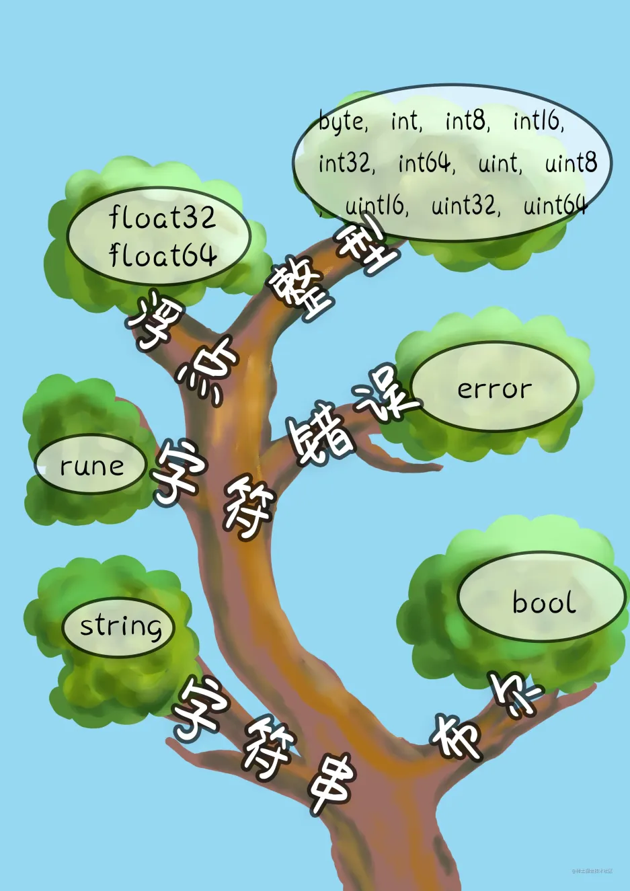

# 02_基本类型与运算符

## 基本类型



### bool

> 布尔类型，只有`true`或`false`两个值,占用一个字节的内存

```go
    a,b := true,false
```

### 整型

| 数据类型    | 说明         | 取值范围                                     |
|---------|------------|------------------------------------------|
| 有符号整数 | |  |
| int8    | 有符号 8位整数  | -128到 127                               |
| int16   | 有符号 16位整数 | -32768 到32767                           |
| int32 | 有符号 32位整数 | -2147483648到2147483647                   |
| int64 | 有符号 64位整数 | -9223372036854775808到9223372036854775807 |
| 无符号整数 | |  |
| uint8   | 无符号8位整数   | 0到255                                   |
| uint16  | 无符号16位整数  | 0到65535                                 |
| uint32  | 无符号32位整数  | 0到4294967295                            |
| uint64 | 无符号64位整数   | 0到18446744073709551615                  |

```go
// byte is an alias for uint8 and is equivalent to uint8 in all ways. It is
// used, by convention, to distinguish byte values from 8-bit unsigned
// integer values.
type byte = uint8

// rune is an alias for int32 and is equivalent to int32 in all ways. It is
// used, by convention, to distinguish character values from integer values.
type rune = int32
```

::: tip
> 如上，字节类型`byte` = uint8 类型，`rune` = int32,这段代码可以在`src/builtin/builtin.go`中找到
:::

### string

> 字符串的概念就是多个byte的集合，一个字符序列用双引号""，或者`` (esc下面的键) 表示。

```go
name := "xianren"
x := 'A'
fmt.Printf("类型%T\n", name) // string
fmt.Printf("类型%T", x) // int32
// 通过len函数可以查看字符串的长度，也可以通过索引获取对应位置的ascall码值
fmt.Println(len(name), name[2]) //7 ，97
```

> 单引号包裹的一般为字符类型，即`rune`,但通过索引从字符串获取到的是`byte`类型，通过`len()`获取的也是`byte`的个数,而不是我们看到的字符的个数，如下例子

```go
name := "李二"
fmt.Println(len(name)) // 6
```

::: tip
go语言字符串使用utf-8编码，一个中文字符需要三个字节来表示,所以在含有非ascall码字符时，不要直接从字符串中通过索引获取字符,可以将它转化成字符数组来获取
:::

```go
name := '李二'
list := []rune(name)
fmt.Println(list) // [26446 20108]
```

### float

|单精度 |浮点类型	|	取值范围|
| --- | ---- | --- |
|float32 |	负数时 |	-3.402823E38 到 -1.401298E-45 |
| float32 |	正数时 |	1.401298E-45 到 3.402823E38 |

|双精度 浮点类型|	取值范围|
| --- | --- |
|float64 |	-1.79E+308 到 +1.79E+308| 

#### 单精度双精度两者区别

> 1. 在内存中占有的字节数不同
> 单精度浮点数在机内占4个字节。
> 双精度浮点数在机内占8个字节。
> 2. 有效数字位数不同
> 单精度浮点数 有效数字7位。
> 双精度浮点数 有效数字16位。
> 3. 使用情况区别
> 一般用来表示美元和分的时候用单精度类型。
> 超出人类经验的数字函数，例如 sin() cos() tan() sqrt() 都使用双精度值。

### 类型转换

> go 语言是静态语言，要求，定义、赋值、 运算、类型一致才能进行操作。所以要进行操作的时候必须保证数据类型一致。需要注意的是，只有兼容的数据类型才能够转换。 强制类型转换的语法 `Type(value)`

数值间转换

```go
    var a int8 = 22
    var b int16 = 44
    var c = b - int16(a) // 类型一致时才能运算
    fmt.Println(c)
```

浮点型转整型

```go
    d := 3.345

    fmt.Println(int(d)) // 3 只保留整数部分
```

> 与字符串之间的互相转换，在下一节会讲到
