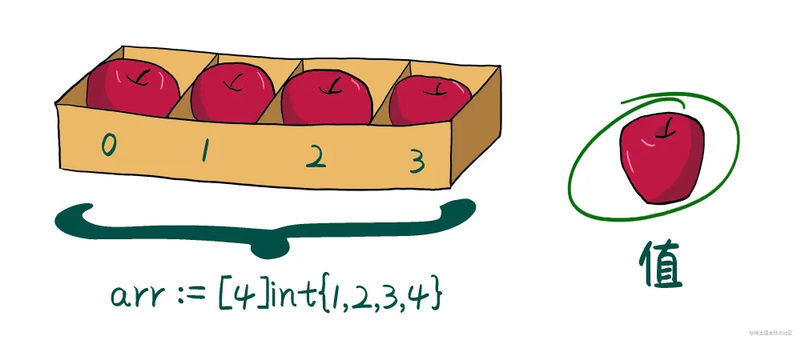
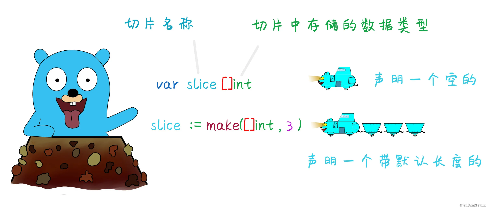

# 05_数组和切片

## 数组

> 可以存储多个同类型值的容器


### 声明数组

`var 数组名 [数组容量] 数据类型`

> - 数组只能用来存储一组相同类型的数据结构。
> - 数组需要通过下标来访问，并且有长度和容量
> - 数组有长度限制，访问和复制不能超过数组定义的长度，否则就会下标越界。
> - 数组的长度，用内置函数 `len()`来获取。
> - 数组的容量，用内置函数 `cap()`来获取。

::: code-group

```go [数组声明]
// 数组
func array() {
    // 声明数组
    var a [3]int
    // 根据索引赋值
    a[0] = 5
    // 获取数组长度和容量
    fmt.Println(len(a), cap(a)) // 3 3
}
```

:::

::: tip
数组在初始化时会给没有赋值的位置默认填充对应数据类型的零值，如int类型的0，string的""
:::

### 创建数组

#### 直接赋值

> 如果知道数组中的元素可以直接赋值，可以小于指定长度，没有数值会自动填充

::: code-group

```go
arr1 := [3]int {1,2,4}
```

:::

#### 指定索引赋值

> 可以给指定的索引位置赋值

::: code-group

```go
arr1 := [3]int {0:1,2:3} //=> arr1[0] = 1 arr1[2] = 3
```

:::

#### 省略数组长度

> 在创建数组时，可以省略数组的长度，让它通过后面的赋值来自动推断

::: code-group

```go [省略数组长度]
arr1 := [...]int {1,2,3}
arr2 := [...]int {1:2,6:7}
```

:::

> 指定索引会按照最大索引来创建数组

::: code-group

```go [创建数组]
func create() {
    arr1 := [...]int{1, 2, 4}
    arr2 := [...]int{1: 3, 7: 9}
    fmt.Println(arr1, arr2)
    /*
        [1 2 4]
        [0 3 0 0 0 0 0 9]
    */
}
```

:::

#### 多维数组

> 以二维为例

::: code-group

```go [二维数组]
// arr := [一维数组的个数][一维数组容量]{{一维数组值},{一维数组值}}
func dimension() {
    arr1 := [3][3]int{{1, 2, 3}, {4, 5, 6}}
    fmt.Println(arr1) // [[1 2 3] [4 5 6] [0 0 0]]
}
```

:::

::: tip
注意：与很多语言不同，go语言的数组是值类型，所以数组变量中存的就是数组中的所有值而非第一个位置的指针，将数组变量赋值给其他变量就是把所有的数据复制了一份过去
:::

::: code-group

```go
func main(){
    a := [3]int{1,2,4}
    b := a 
    b[2] = 3
    fmt.Println(a,b) // [1,2,4] [1,2,3] 不会影响原数组
}

```

```java
public static void main(String[] args) {
        int a[] = {1,2,4};
        int[] b = a;
        a[2] = 3;
        System.out.println(a[2]); // 3
        System.out.println(b[2]); // 3
    }
```

:::

## 切片

> 切片（slice）是对数组一个连续片段的引用（该数组我们称之为相关数组，通常是匿名的），所以切片是一个引用类型（因此更类似于 C/C++ 中的数组类型，或者 Python 中的 list 类型）。这个片段可以是整个数组，或者是由起始和终止索引标识的一些项的子集。需要注意的是，终止索引标识的项不包括在切片内。切片提供了一个相关数组的动态窗口。
> 切片是可索引的，并且可以由  `len()`函数获取长度。
> 给定项的切片索引可能比相关数组的相同元素的索引小。和数组不同的是，切片的长度可以在运行时修改，最小为 0 最大为相关数组的长度：切片是一个 **长度可变的数组**。
> 切片提供了计算容量的函数 `cap()` 可以测量切片最长可以达到多少：它等于切片的长度 + 数组除切片之外的长度。如果 s 是一个切片，cap(s) 就是从 s[0] 到数组末尾的数组长度。切片的长度永远不会超过它的容量，所以对于 切片 s 来说该不等式永远成立：`0 <= len(s) <= cap(s)`。
> 多个切片如果表示同一个数组的片段，它们可以共享数据；因此一个切片和相关数组的其他切片是共享存储的，相反，不同的数组总是代表不同的存储。数组实际上是切片的构建块。
> **优点** 因为切片是引用，所以它们不需要使用额外的内存并且比使用数组更有效率，所以在 Go 代码中 切片比数组更常用。

::: tip
切片可以看作一个长度可变的数组，与数组不同的是它是引用类型,切片在内存中的组织方式实际上是一个有 3 个域的结构体：指向相关数组的指针，切片长度以及切片容量,这个将在进阶中详细描述
:::

### 声明切片

> 与数组不同的是，不需要指定[] 里面的长度

::: code-group

```go
var slice []int
var slice = []int{1,2,3,4}
```

:::

> 切片的初始化格式是：`var slice1 []type = arr1[start:end]`。
> 从相关数组索引start到end-1的引用，如果写 `var slice []type = arr1[:]`,则表示对相关数组所有值的引用，是arr1[0:len(arr1)]的缩写
> `start` 不写即为从索引0开始,`end`不写则代表引用到数组末尾

### 创建切片

> 通常情况下，使用make函数来创建一个切片，切片有长度和容量，默认情况下它的容量与长度相等。所以可以不用指定容量



#### 复制与追加

##### copy

> 用于将一个切片中的值复制到另一个切片中

`copy(target,origin) int`
> 返回值为复制的数量

##### append

> 用于往切片末尾追加元素,可以添加多个

`append(s[]T,x ...T) slice`
> 将一个切片添加到另一个切片

`append(x,y...)`
> 类似于js中拓展运算符的用法

::: code-group

```go [追加slice]
s1 := make([]int,0,10)
s2 := []int{1,2,3}
s1 = append(s1,s2...)
fmt.Println(s1) // [1,2,3]
```

:::

::: code-group

```go
// 切片
func slice() {
    x := []int{1, 2, 3, 4, 5}
    y := make([]int, 4)
    // 复制
    copy(y, x)
    // 追加
    x = append(x, 11, 12, 13)
    fmt.Println(x, y) // [1 2 3 4 5 11 12 13] [1,2,3,4]
}
```

:::
> copy函数是深拷贝，直接复制值，目标切片的长度不够，则只会复制一部分
> append会返回一个切片地址，如果容量变化，地址也会变化,所以我们通常用原本的切片变量来接收返回值，防止地址的变化

::: tip

每一个切片都引用了一个底层数组。
切片本身不能存储任何数据，都是这底层数组存储数据，所以修改切片的时候修改的是底层数组中的数据
当切片添加数据时候，如果没有超过容量，直接进行添加，如果超出容量自动扩容成倍增长
切片一旦扩容，指向一个新的底层数组内存地址也就随之改变

:::
