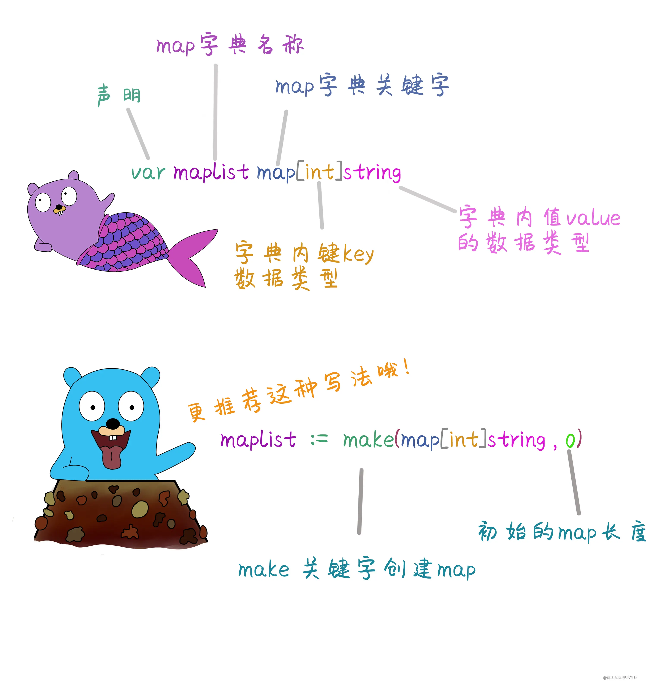
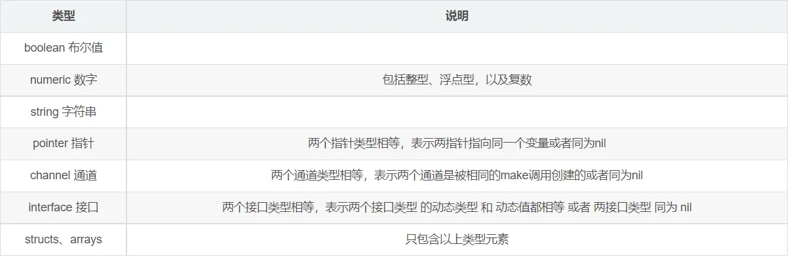

# 06_map

> map 是一种特殊的数据结构：一种元素对（pair）的无序集合，pair 的一个元素是 key，对应的另一个元素是 value，所以这个结构也称为关联数组或字典。这是一种快速寻找值的理想结构：给定 key，对应的 value 可以迅速定位。
> map 这种数据结构在其他编程语言中也称为字典（Python）、hash 和 HashTable 等

::: info

1. map是无序的、长度不固定、不能通过下标获取，只能通过key来访问
2. map的长度不固定 ，也是一种引用类型。可以通过内置函数 len(map)来获取map长度。
3. 创建map的时候也是通过make函数创建。
4. map的key不能重复，如果重复新增加的会覆盖原来的key的值。

:::



::: code-group

```go [创建map]
//1, 声明map 默认值是nil
var m1 map[key_data_type]value_data_type
声明  变量名称 map[key的数据类型]value的数据类型
//2，使用make声明
m2:=make(map[key_data_type]value_data_type)
//3,直接声明并初始化赋值map方法
m3:=map[string]int{"语文":89,"数学":23,"英语":90}
```

:::

::: warning
map在初始化之前值为nil，无法使用，直接赋值会报错
:::

::: code-group

```go
// 初始化
func initialize() {
    var x map[int]string
    x = make(map[int]string) // 初始化map
    x[0] = "xianren"
    fmt.Println(x) // map[0:xianren]
}
```

:::

::: tip
map虽然可以动态扩容，但为了性能考虑，对于大的 map 或者会快速扩张的 map，即使只是大概知道容量，也最好先标明。
:::

## key和value取值

> key 可以是任意可以用 == 或者 != 操作符比较的类型，比如 string、int、float
> value 可以是任意值



::: tip
在go 1.18版本中引入了泛型,这种类型我们通常称为可比较类型,一般这样约束`[T comparable]`
:::

## 对map内容操作

### 获取对应值

`x := maplist[key]`

### 判断键值对是否存在

`val,ok := maplist[key]`
> 返回两个值，val为当前键对应的值，ok是一个bool,判断键值对是否存在

### 赋值或修改值

`maplist[key] = value`

### 删除值

`delete(map,key)`

::: code-group

```go
// map操作
func operateMap() {
    x := make(map[int]string, 10)
    // 判断是否存在
    val, ok := x[0]
    fmt.Println(val, ok)
    // 获取值与赋值
    x[0] = "xianren"
    y := x[0]
    fmt.Println(x, y)
    // 删除键值对
    delete(x, 0)
    fmt.Println(x, len(x))
    /* 
        false
        map[0:xianren] xianren
        map[] 0
    */

}
```

:::

### map的遍历

> 通过for-range来获取key和value

`for key,value := range map{}`
