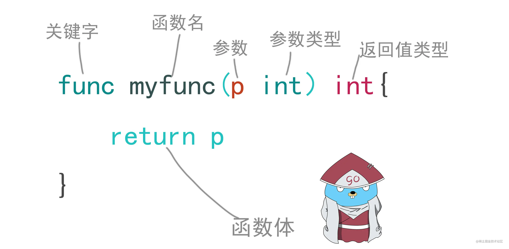
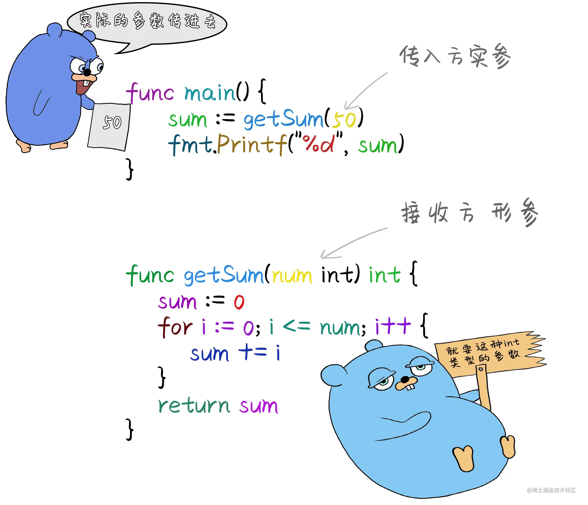
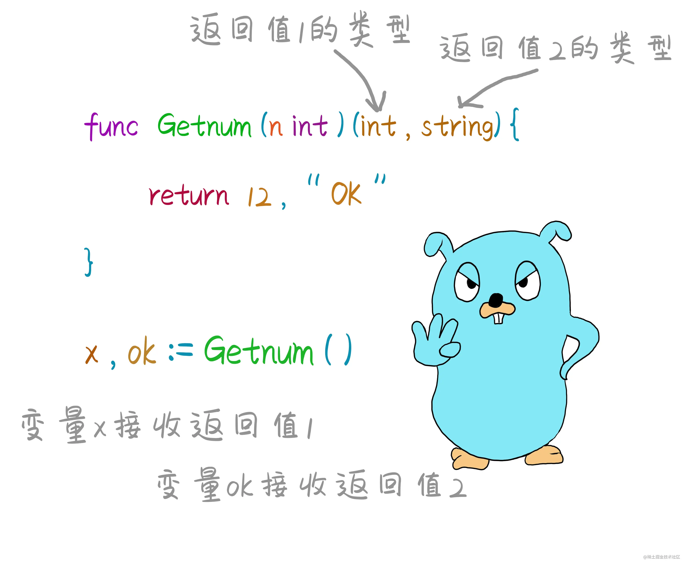

# 07_函数

> 函数代表了代码执行的逻辑，咱们前面已经用到过，Go语言中函数的关键字是func加上函数名，参数列表，返回值和函数体，构成一个函数。我们在开发一个程序中一定会包含很多个函数



::: info
自定义函数首字母为大写，代表函数为公共的，可以被其他包调用，类似java `public`
关键字小写则代表只能在当前包调用，类似`private`
:::

## 参数和返回值

### 参数

> 函数参数分为 形式参数 也叫形参，在函数定义的时候用于接收外部传入的数据变量， 函数中某些变量数值无法确定， 需要由外部传入。 实际参数 也叫实参， 函数调用的时候，给形参赋值的实际数据。 可变参数 表示可以传入的参数个数不固定， 表示可以传入任意数量的参数。



#### 不定长参数

> 如果函数的最后一个参数是采用 ...type 的形式，那么这个函数就可以处理一个变长的参数，这个长度可以为 0，这样的函数称为变参函数。

::: code-group

```go
func myFunc(a, b, arg ...int) {}
```

:::

> 这个函数接受一个类似某个类型的 slice 的参数，该参数可以通过索引获取指定位置的值，也可以通过for循环迭代

::: code-group

```go
package main

import (
    "fmt"
)

// 主函数
func main() {
    changeable("xianren", 11, 12, 12, 23, 12, 334) // xianren 12

}

// 不定长参数
func changeable(x string, y ...int) {
    fmt.Println(x, y[1])
}
```

:::

### 返回值

> 相比与 C、C++、Java 和 C#等，多值返回是 Go 的一大特性



::: code-group

```go
package main

import "fmt"

// 主函数
func main() {
    a, b := argu(1, 3)
    fmt.Println(a, b) // 2 4
}

// 返回值和参数
func argu(x int, y int) (int, int) {
    return x + 1, y + 1
}
```

:::

> 函数可以定义多个返回值，并且返回值类型，返回值数量都必须是一一对应的，return是将结果返回到函数的调用处，结束函数的执行。 _ 空白标识符，舍弃返回的数据

::: tip
通常，我们会将返回值的最后一位设置为错误信息,`error`
:::

### 命名的返回值

> 1. 指定返回值的名字，当需要返回的时候，我们只需要一条简单的不带参数的return语句。需要注意的是，即使只有一个命名返回值，也需要使用 `()` 括起来
> 2. Go 的返回值可被命名，它们会被视作定义在函数顶部的变量。
> 3. 返回值的名称应当具有一定的意义，它可以作为文档使用。
> 4. 没有参数的 return 语句返回已命名的返回值。也就是直接返回。

::: code-group

```go
package main

import (
    "fmt"
)

// 主函数
func main() {
    x1, y1 := nominate()
    fmt.Println(x1, y1) // 12 xianren
}

// 命名的返回值
func nominate() (x1 int, y1 string) {
    // 相当于在第一行定义了，所以直接赋值即可
    x1 = 12
    y1 = "xianren"
    return
}
```

:::

::: tip
尽量使用命名返回值：会使代码更清晰、更简短，同时更加容易读懂。
:::

### 传递指针

> 传递指针给函数不但可以节省内存（因为没有复制变量的值），而且赋予了函数直接修改外部变量的能力，所以被修改的变量不再需要使用 return 返回

```go
package main

import (
    "fmt"
)

// 主函数
func main() {
    n := 0
    replay := &n
    pointer(3, 4, replay)
    fmt.Println(n) // 12
}
// 传递指针
func pointer(x int, y int, replay *int) {
    *replay = x * y
}
```

> 传递指针具有性能优势，但必须注释清楚

### 匿名函数

> 匿名也就是没有名字的函数，定义一个匿名函数直接加上()就相当于直接调用了，（类似js立即执行函数）通常只能调用一次，可以将匿名函数赋值给一个变量，这个变量就代表了这个函数。则可以调用多次。

::: info
如果要给匿名函数命名，则要被赋值的变量必须先声明
:::

::: code-group

```go
// 匿名函数
    var y func()int
    y := func() int {
        y := 12
        return y
    }()
    fmt.Println(y) // 12
```

:::

## defer语句

> defer 表示延时推迟的意思，在go语言中用来延时一个函数或者方法的执行。如果一个函数或者方法添加了defer关键字，表示则暂时不执行，等到主函数的所有方法都执行完后才开始执行。
> 当多个函数被defer的时候他们被添加到一个堆栈中，并且根据先进后出的原则执行

::: code-group

```go
package main

import (
    "fmt"
)

// 主函数
func main() {
    defer test1()
    defer test2()
    test3()

    /*  
        我是3
        我是2
        我是1
    */

}

// defer
func test1() {
    fmt.Println("我是1")
}
func test2() {
    fmt.Println("我是2")
}
func test3() {
    fmt.Println("我是3")
}
```

::: tip
defer函数调用时候，参数已经传递了，（再修改参数的值不会生效）只不过代码暂时不执行而已。等待主函数执行结束后，才会去执行
:::

::: code-group

```go [defer]
func testDefer() {
    var a = 12
    defer fmt.Println(a) // 12 参数已经传递，只不过延后执行
    a = 13
    fmt.Println(a) // 13
}
```

:::

#### 闭包
> go语言支持将一个函数作为参数传递，也支持将一个函数作为返回值。一个外层函数当中有内层函数，这个内层函数会操作外层函数的局部变量。并且，外层函数把内层函数作为返回值，则这里内层函数和外层函数的局部变量，统称为 **闭包结构** 。 这个外层函数的局部变量的生命周期会随着发生改变，原本当一个函数执行结束后，函数内部的局部变量也会随之销毁。但是闭包结构内的局部变量不会随着外层函数的结束而销毁。

::: code-group

```go
package main

import (
    "fmt"
)

// 主函数
func main() {
    // 闭包
    f2 := closure()
    f2() //2
    f2() //3
}
// 闭包
func closure() (inner func()) {
    i := 1
    inner = func() {
        i++
        fmt.Println(i)
    }
    return
}
```

:::

> 调用内层函数会访问到外层函数的作用域

::: tip
与很多语言类似，在go语言中，函数也是一种类型，所以可以将一个函数作为另一个函数的参数传递func1()和func2()是两个函数，将func1函数作为func2这个函数的参数，func2函数就叫做高阶函数，因为他接收了一个函数作为参数。所以func1叫做回调函数，他作为另一个函数的参数。
:::

::: code-group

```go
// 将函数赋值给变量
var f1 func()
f1 := func() {
        fmt.Println("函数调用")
    }
f1() // 函数调用
```

:::
