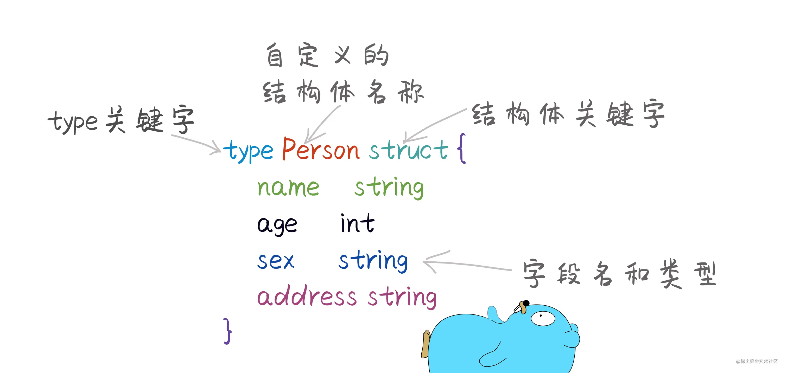
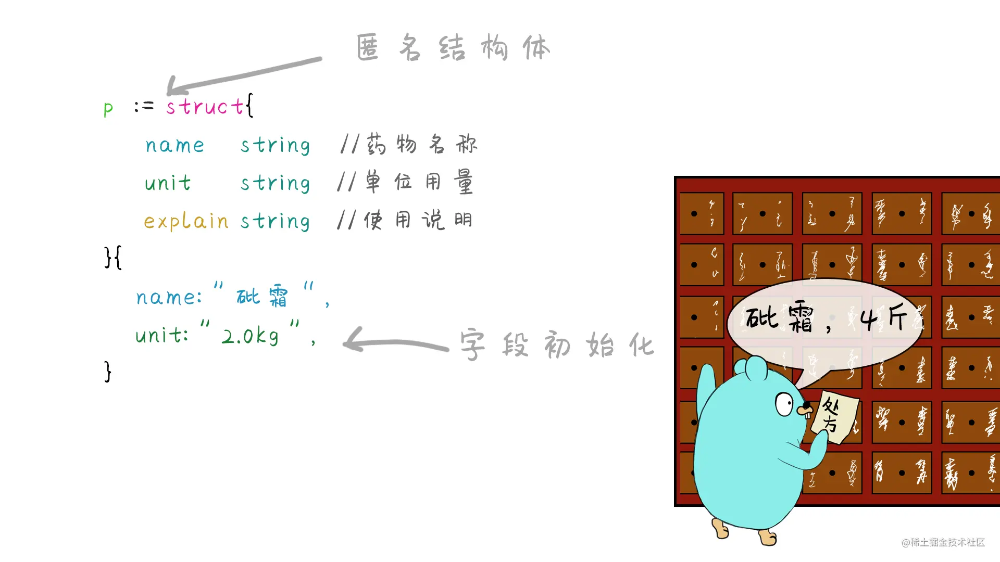
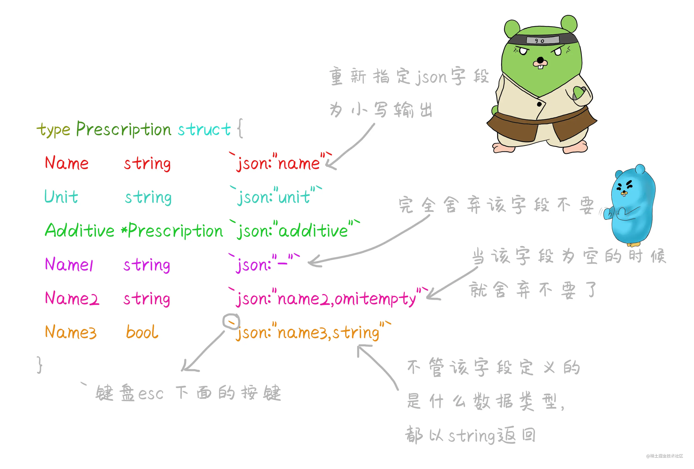
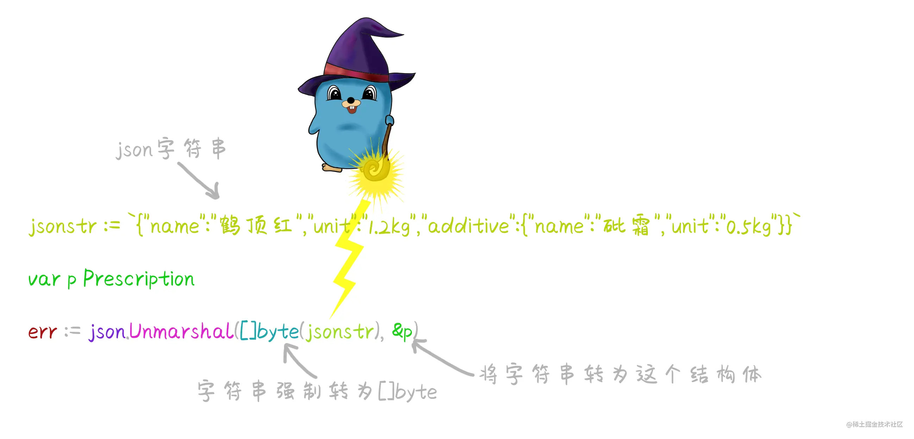

# 09_结构体

> 在Go语言中不存在`Class`类的概念,但是可以通过结构体`struct`来实现。结构体就是一种相同类型，或者不同类型的数据构成的数据的集合。里面的每一个变量叫做成员变量。也就是结构体的字段。每一个字段拥有自己的数据类型和数值。



> 结构体定义之后也只是确定了这个结构长什么样子，都有哪些字段，并没有真实的数据，所以需要使用结构体时必须先实例化结构体。赋予结构体真实存在的意义。

## 实例化

::: code-group

```go
// 结构体的初始化和声明
func initialize() {
    // 定义结构体
    type Person struct {
        name string
        age  int
        sex  bool
    }
    //结构体实例化
    p1 := Person{}
    p1.name = "xianren"
    //直接给成员变量赋值
    p2 := Person{name: "xianren1", age: 20, sex: true}
    // 通过new关键字初始化
    p3 := new(Person)
    p3.name = "xiaoli"
    p3.age = 12
    fmt.Println(p1, p2, p3) // {xianren 0 false} {xianren1 20 true} &{xiaoli 12 false}

}
```

:::

> 结构体内的每一个字段，都有自己相应的数据类型，如果结构体被实例化后，字段的默认值就是该字段类型的零值，int就是0，string就是"",如果是指针类型，默认就是nil。
::: tip
go语言中`new`方法的用法与其他语言差不多，都是开辟一片内存空间，并返回地址，但我们通常很少用它
:::

## 匿名结构体

> 不需要type关键字，没有类型名称的结构体



## 匿名字段和内嵌结构体

> 结构体可以包含一个或多个 **匿名（或内嵌）字段**，即这些字段没有显式的名字，只有字段的类型是必须的，此时类型就是字段的名字。匿名字段本身可以是一个结构体类型，即 **结构体可以包含内嵌结构体**。可以用来模拟继承行为

::: info

1. 在一个结构体中对于每一种数据类型只能有一个匿名字段
2. 外层结构体可以通过点的方式直接获取内层结构体的属性
3. 可以理解为外层结构体继承了内嵌结构体的属性
:::

::: code-group

```go
// 父结构体
type Father struct {
    name string
    age  int
}

// 子结构体
type Son struct {
    Father
    school string
    height int
}

func extend() {
    s := Son{Father{name: "xianren", age: 20}, "sanxia", 175}
    // 直接通过点获取内嵌结构体的属性
    fmt.Println(s.age)    // 20
    fmt.Println(s.height) // 175
}
```

::: tip
go语言并没有真正的继承,这些结构体的组合也仅仅是模拟继承,所以在普通面向对象语言中,继承类的类型依然属于父类,但go语言并不会
:::

::: code-group

```go
package main

type Father struct {
    name string
}
type Son struct {
    Father
    age int
}

func main() {
    son := Son{Father: Father{name: "father"}, age: 18}
    var father Father = son // cannot use son (variable of type Son) as Father value in variable declaration,内型不兼容,报错
}
```

```ts
class Father {
  public name: string
  constructor(name: string) {
    this.name = name
  }
}

class Son extends Father {
  public age: number
  constructor(name: string, age: number) {
    super(name)
    this.age = age
  }
}

let son = new Son('xiaoming', 18)
let father: Father = son // 可以直接赋值给父类类型的变量
```

:::

## 结构体转json

> Go语言提供了json操作的包

```go
import "encoding/json"
```

`json.MarShal(struct)`
> 转化时结构体字段首字母必须大写，转化时只会转化大写的

::: code-group

```go [json]
func jsonn() {
    p := struct {
        Name string
        Age  int
    }{
        Name: "xianren",
        Age:  20,
    }
    // 转化为json字符串，返回两个值，一个为成功的结果，一个为失败的原因
    x, err := json.Marshal(p)
    if err != nil {
        fmt.Println(err)
        return
    }
    // 将byte slice转化为字符串
    fmt.Println(string(x)) // {"Name":"xianren","Age":20}
}
```

:::

## 结构体标记

> 可以指定输出的字段名，以及省略空字段，



::: tip
结构体`tag`是一个很重要的属性,在go语言中,通常在结构体与各种文件进行转换时指定输出的字段名称,例如`yaml`,`json`等,还可以用在`orm`框架中,这些功能是通过反射来实现的
:::

## json转结构体

`json.Unmarshpal(byte slice,结构体指针)`
> 返回值为错误的原因



::: code-group

```go
// json转结构体
func jsonto() {
    type Person struct {
        Name string
        Age  int
    }
    str := `{"Name":"xianren","Age":20}`
    // 创建一个结构体指针
    p := new(Person)
    if err := json.Unmarshal([]byte(str), p); err != nil {
        fmt.Println(err)
    }
    fmt.Println(*p) // {xianren 20}
}
```

:::
