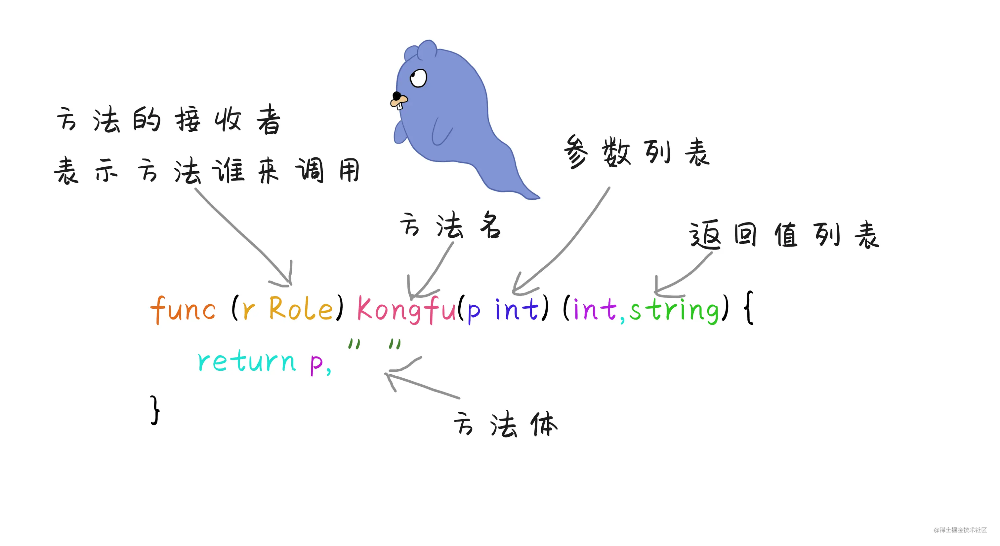

# 10_方法

> 在Go语言中方法和函数类似，也可以认为方法是特殊类型的函数，只不过方法限制了接收者，方法也可以说是包含了接收者的函数。



> 在Go语言中可以为各种类型来指定方法，通常为结构体和指针（类似于其他语言中类的方法），还可以给自定义类型来指定方法.

::: code-group

```go
package main

import "fmt"

func main() {
    p := Person{name: "xianren", age: 20}
    p.ofStruct() // xianren 20
    p1 := &p
    p1.ofPoint() // xianren 20
    var a A
    a = 1
    a.ofAny() // 1

}

type Person struct {
    name string
    age  int
}

// 自定义类型
type A int

// 结构体调用方法
func (p Person) ofStruct() {
    fmt.Println(p.name, p.age)
}

// 指针调用方法
func (p *Person) ofPoint() {
    fmt.Println(p.name, p.age)
}

// 任意类型调用
func (i A) ofAny() {
    fmt.Print(i)
}

```

:::

::: info
函数和方法的区别

1. 方法限制某个类别的行为,需要指定调用者。函数是一段独立的功能代码,可以直接调用。
2. 方法名称可以相同，只要接收者不同就可以，函数命名上不能冲突(同一个包内)。

:::

::: tip
方法的接收者其实可以看做一个特殊的参数，它与其他参数一样也是通过值传递的，所以在方法内部如果要修改结构体，我们通常使用指针作为接收者
:::
