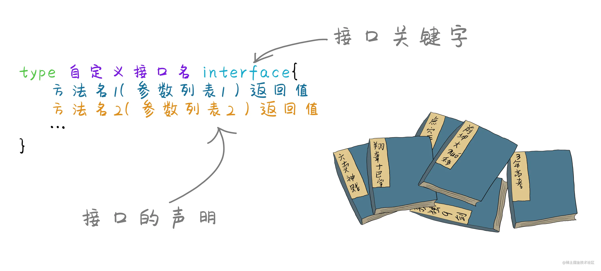

# 11_接口

> 接口的意义是对其他类型的一个概括，接口内可以定义很多个方法，谁将这些方法实现，就可以认为是实现了该接口。Go语言的多态，主要是通过接口来实现。



> 接口是对行为的约束，例如有一个飞行接口，那么只要可以飞，不管是什么东西，不管它是通过翅膀，飞机，还是什么，只要有飞行这个行为，就可以认为是实现了该接口,换句话说，接口只关注行为。

::: code-group

```go [接口]
type Namer interface {
    Method1(param_list) return_type
    Method2(param_list) return_type
    ...
}
```

:::

> （按照约定，只包含一个方法的）接口的名字由方法名加 [e]r 后缀组成，例如 Printer、Reader、Writer、Logger、Converter 等等。还有一些不常用的方式（当后缀 er 不合适时），比如 Recoverable，此时接口名以 able 结尾，或者以 I 开头（像 .NET 或 Java 中那样）。

::: info

1. 类型不需要显式声明它实现了某个接口：接口被隐式地实现。多个类型可以实现同一个接口。
2. 实现某个接口的类型（除了实现接口方法外）可以有其他的方法。
3. 一个类型可以实现多个接口。
4. 接口类型可以包含一个实例的引用， 该实例的类型实现了此接口（接口是动态类型）。

:::

::: code-group

```go
package main

import "fmt"

func main() {
    testInface()
}

type Shaper interface {
    // 定义一个方法
    SayHello()
}

// 结构体
type Person struct {
    name string
    age  int
}

type Student struct {
    school string
    height int
}

// Person 实现接口方法
func (p Person) SayHello() {
    fmt.Println("hello")
}

// Student 实现接口方法
func (s Student) SayHello() {
    fmt.Println("你好")
}

// 测试接口
func testInface() {
    //
    p := Person{"xianren", 20}
    //
    s := Student{"sanxia", 175}
    // 实现接口
    var i Shaper
    var z Shaper
    i = p
    z = s
    i.SayHello() // hello
    z.SayHello() // 你好

}
```

:::

## 空接口

> 空接口就是不包含任何方法的接口，所有的类型都可以实现空接口，因此空接口可以实现存储任意类型的数据， 谁实现它就被看作是谁的实现类。

::: code-group

```go
// 空接口
type T interface {
}
// 测试空接口
func testEmpty() {
    // 定义一个空接口数组
    Oarr := make([]T, 10)
    Oarr[0] = "xianren"
    Oarr[1] = 0
    Oarr[2] = true
    Oarr[3] = []T{1, 2, 3, 4}
    fmt.Println(Oarr) // [xianren 0 true [1 2 3 4] <nil> <nil> <nil> <nil> <nil> <nil>]

}
```

:::

::: tip
任何类型都可以实现`interface{}`空接口,例如`fmt.Println(),fmt.Printf()`之类的函数，参数都是用空接口来表示。
在go 1.18版本，引入了一个更语义化的关键字，`any`,它可以表示空接口类型
:::
