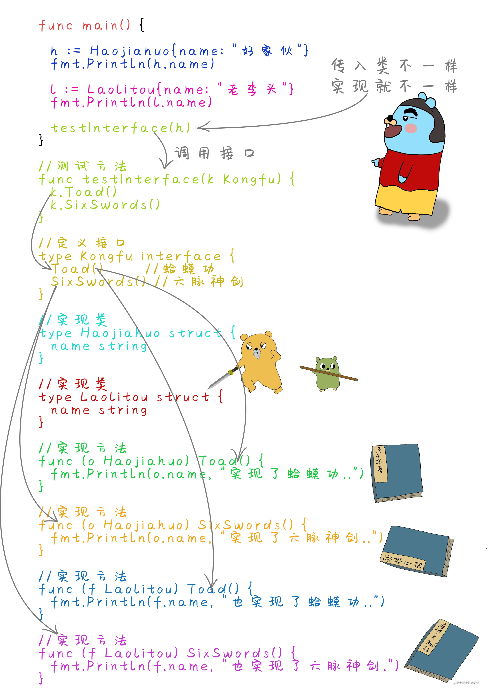

# 12_面向对象

> 其实在Go语言中是没有面向对象的，但是Go语言的语法设计，我们可以借助结构体，方法，接口的实现，来模拟其他语言中的面向对象的概念。首先了解一下什么是面向对象，面向对象中的三大特征是：
>
> - 封装 在意义上是把许多客观的事物封装成一个抽象的类,把自己的属性 方法只让可信的对象操作。
> - 继承 子类可以访问父类的属性和方法，子类也可以拥有自己的属性和方法。子类可以重写父类的方法。
> - 多态 是指一个程序中同名的方法共存的情况，调用者只需使用同一个方法名，系统会根据不同情况，调用相应的不同方法，从而实现不同的功能。多态性又被称为“一个名字，多个方法”。

## 1.通过结构体实现封装

> Go语言中没有像java或者.net中的class类，不过可以把struct结构体看成一个类，结构体如果用面向对象的思维来理解，结构体把字段封装到一起，数据被保护在结构体内部，程序需要访问字段的时候，需要通过结构体来访问。

::: code-group

```go
package main

import "fmt"

func main() {
    p := NewPerson("xianren", 21)
    fmt.Println(p.GetName()) // xianren
    p.SetName("xiaoli")
    fmt.Println(p.GetName()) // xiaoli
}

// 定义结构体
type Person struct {
    Name string
    Age  int
}

// 定义构造函数，用于创建结构体指针
func NewPerson(name string, age int) *Person {
    return &Person{
        Name: name,
        Age:  age,
    }
}

// 指定方法用于访问属性
func (p *Person) GetName() string {
    return p.Name
}

// 指定方法用于设置属性
func (p *Person) SetName(name string) {
    p.Name = name
}
```

:::

## 2.继承的实现

> 通过内嵌结构体可以实现继承效果，子类可以拥有父类属性，调用父类方法

::: code-group

```go
type Person struct {
    Name string
    Age  int
}

// 定义结构体
type Student struct {
    // 嵌套结构体，做父类
    Person // 包含父类所有属性
    sex    bool
    school string
}

// 定义构造函数，用于创建结构体指针
func NewPerson(name string, age int) *Person {
    return &Person{
        Name: name,
        Age:  age,
    }
}

// 指定方法用于访问属性
func (p *Person) GetName() string {
    return p.Name
}

// 指定方法用于设置属性
func (p *Person) SetName(name string) {
    p.Name = name
}

func extend() {
    s := Student{Person{"xianren", 20}, true, "sanxia"}
    // 子类调用父类方法
    s.GetName()
    s.SetName("xiaoli")
    fmt.Println(s.Name) // 小李
}
```

:::

## 3.接口实现多态


> 多个结构体实现同一个接口，传递参数时只需要传递这个接口类型，但在调用方法的时候，同一个方法，每个结构体实例也会有不同的行为。这样就实现了Go语言中的多态.
