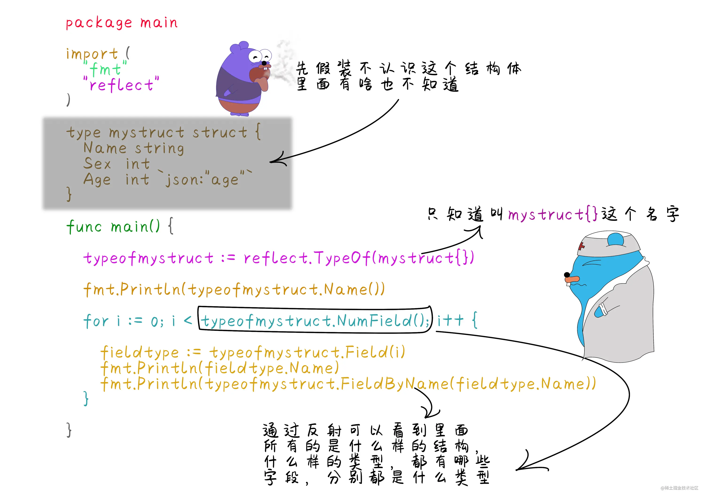

# 13_反射

> Go语言官方文档中是这样定义反射，在计算机领域中反射是一种让程序通过类型理解其自身的结构的一种能力。其实反射本质上就是在程序运行时候，来获取对象的类型信息或者结构，进行访问或者修改。
> Go语言在运行期使用reflect包访问程序的反射信息。

::: tip
反射在标准库`fmt`包中使用的十分频繁,还有一些`orm`框架也通过反射来获取运行时信息,但反射会影响性能,如果在一些高性能场景,不推荐使用反射,例如一些算法,我们输入输出都通过自己封装，而不是通过`fmt`
:::

::: code-group

```go [封装输入输出]
import (
    "bufio"
    "os"
    "strconv"
)

var in, out = bufio.NewReader(os.Stdin), bufio.NewWriter(os.Stdout)

func read() int {
    // 指示是否有-号
    flag := false
    ret := 0
    for c, _ := in.ReadByte(); (c >= '0' && c <= '9') || c == '-'; c, _ = in.ReadByte() {
        if c == '-' {
            flag = true
        continue
    }
        ret = (ret * 10) + int(c-'0')
    }
    if flag {
        ret = -ret
    }
    return ret
}
```

:::
> `bufio`将会在下一节说到

## 获取值对象和类型对象

> 一个普通的变量包含两个信息，一个是类型type，一个是值value。type指的是系统中的原有的数据类型，如：int、string、bool、float32 等类型。 在Go语言中可以通过 reflect.TypeOf() 函数获取任意值的类型对象，程序通过这个类型对象，可以获取任意的类型信息。有了类型对象和值对象，就可以获取到当前任意类型的类型信息和值信息。

`reflect.TypeOf(target) / reflect.TypeOf(target).Name()`
> 获取目标类型 / 目标类型的名称

`reflect.ValueOf(target) / reflect.ValueOf(target).类型()`
> 获取目标值对像 / 获取目标值

::: code-group

```go
// 获取类型和值
func getVandT() {
    x := "xianren"
    // 获取类型对象
    t := reflect.TypeOf(x)
    // 获取类型名称为string
    n := t.Name()
    // 获取值对象
    v := reflect.ValueOf(x)
    // 获取值
    value := v.String()
    fmt.Println(t, n, v, value) // string string xianren xianren
}
```

:::

## 获取类型种类

> 在反射中还定义了另外一种叫种类`Kind`，种类`Kind`与`type`还是有区别的。`Kind`指的是对象归属的品种，在反射中定义了下列这些种类。
>
> **_种类 :例如所有的结构体它们的种类都是struct_**

`reflect.TypeOf(target).Kind()`

::: code-group

```go [GOROOT/src/reflect/type.go]
type Kind uint

const (
    Invalid       Kind = iota //非法类型
    Bool                      //布尔型
    Int                       //有符号整型
    Int8                      //有符号8位整型
    Int16                     //有符号16位整型
    Int32                     //有符号32位整型
    Int64                     //有符号64位整型
    Uint                      //无符号整型
    Uint8                     //无符号8位整型
    Uint16                    //无符号16位整型
    Uint32                    //无符号32位整型
    Uint64                    //无符号64位整型
    Uintptr                   //指针
    Float32                   //单精度浮点类型
    Float64                   //双精度浮点类型
    Complex64                 //64位复数类型
    Complex128                //128位复数类型
    Array                     //数组
    Chan                      //通道
    Func                      //函数
    Interface                 //接口
    Map                       //字典
    Ptr                       //指针
    Slice                     //切片
    String                    //字符串
    Struct                    //结构体
    UnsafePointer             //底层指针
)
```

:::

> 上面的代码就是`reflect`包中对`kind`的定义

::: code-group

```go [kind]
func getKind() {
    // 初始化数据
    p := Person{"xianren", 20}
    a := [3]string{"11", "xx", "55"}
    // 获取类型名和类型种类
    fmt.Println(reflect.TypeOf(p).Name()) // Person
    fmt.Println(reflect.TypeOf(p).Kind()) // struct
    fmt.Println(reflect.TypeOf(a).Name())
    fmt.Println(reflect.TypeOf(a).Kind()) // array
}
```

:::

## 获取指针指向的元素

> 前面学习指针时候，如果要取指针指向的具体的数据时通过`*` 解引用来获取指针的值。在反射中获取指针类型的对象时，通过`reflect.Elem()`方法获取这个指针指向的元素类型。

`reflect.TypeOf(target).Elem().Name() / reflect.TypeOf(target).Elem()`
> 获取指针类型指向元素的类型名称 /  获取指针类型指向元素的类型对象

`reflect.TypeOf(target).Elem().Kind()`
> 获取指针类型指向元素的类型种类

`reflect.ValueOf(target).Elem() / reflect.ValueOf(target).Elem().类型()`
> 获取指针类型指向元素的值对象 / 将指针指向的值转化为指定类型

::: code-group

```go [prt]
// ptr
func getPtr() {
    o := 1
    // 指针
    p := &o
    // 获取值
    v := *p
    // 获取类型
    t := reflect.TypeOf(p).Elem().Name()
    // 获取种类
    k := reflect.TypeOf(p).Elem().Kind()
    fmt.Println(v, t, k, reflect.ValueOf(p).Elem()) // 1 int int 1
}
```

:::

## 获取结构体成员类型

> 任意一个类型通过反射 `reflect.TypeOf()`获取反射类型对象，通过反射类型对象可以获取当前结构具体是什么样的类型，如果是结构体时，可以通过反射类型对象的`NumField()`和`Field()`方法获得结构体的详细成员信息。


> 结构体字段类型具有的一些属性，可以通过`FieldBy属性名（xxx）`来筛选

::: code-group

```go [GOROOT/src/reflect/type.go]
type StructField struct {
    Name string        // 字段名
    PkgPath string      // 字段路径
    Type      Type      // 字段反射类型对象
    Tag       StructTag // 字段的结构体标签
    Offset    uintptr   // 字段在结构体中的相对偏移
    Index     []int     // Tpye.FieldByIndex中的返回索引值
    Anonymous bool      // 是否为匿名字段
}

```

:::

> `StructField`在`reflect`包中的定义

::: code-group

```go
// 结构体字段类型
func getAttribute() {
    p := Person{"xianren", 20}
    tList := reflect.TypeOf(p)

    for i := 0; i < tList.NumField(); i++ {
        fmt.Println(tList.Field(i))
    }
    // 通过字段属性获取对应的字段
    fmt.Println(tList.FieldByName("Name"))
}
/* 
        {Name  string  0 [0] false}
        {age main int  16 [1] false}
*/
```

:::

## 通过反射值对象获取任意值

> 通过`reflect.ValueOf(target)`可以获取值对象，若想要具体值，则需要知道其类型，如果不知道具体类型，则可以将其看作interface{}来代替任意类型用于获取值

```go
// 获取任意类型值
func getAny() {
    x := 123
    fmt.Println(reflect.ValueOf(x).Interface()) // 123
} 
```

## 获取结构体成员字段的值

> 通过字段索引或字段属性筛选

::: code-group

```go
func getValue() {
    p := Person{"xianren", 20}
    vList := reflect.ValueOf(p)
    // 索引
    fmt.Println(vList.Field(1)) // 20
    // 属性筛选
    fmt.Println(vList.FieldByName("age")) // 20
}
```

:::

## 反射对象的空值处理

> 反射值对象`reflect.Value`提供了`IsNil()`方法判断空值。`IsValid()`方法判断是否有效。

::: code-group

```go
// 空值处理
func isNull() {
    var a *int
    fmt.Println(reflect.ValueOf(a).IsNil())     // true
    fmt.Println(reflect.ValueOf(nil).IsValid()) // false
}
```

:::

## 修改变量的值

> reflect.Value值对象支持修改反射出的元素的值。

::: code-group

```go
// 修改值
func revise() {
    a := 1
    v := reflect.ValueOf(&a).Elem()
    v.SetInt(3)
    fmt.Println(a) // 3
}
```

:::
> 需要通过地址来修改

## 调用函数

> 反射的值对象reflect.Value如果返回的类型是一个函数，那么这个函数是可以通过Call()方法直接调用的。

::: code-group

```go
func add(x int) int {
    x++
    return x
}

// 调用函数
func callFunc() {
    f := reflect.ValueOf(add)
    // 参数必须也是反射值对象
    para := []reflect.Value{reflect.ValueOf(10)}
    // 调用函数,获取返回值切片
    res := f.Call(para)
    // 
    fmt.Println(res[0].Int()) // 11
}
```

:::
