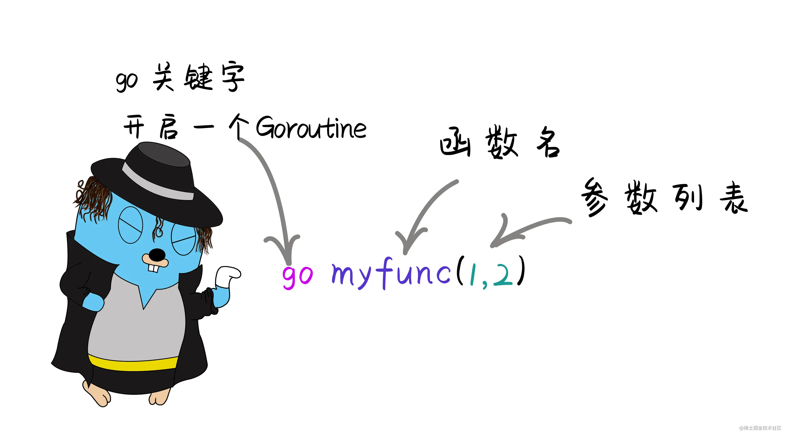
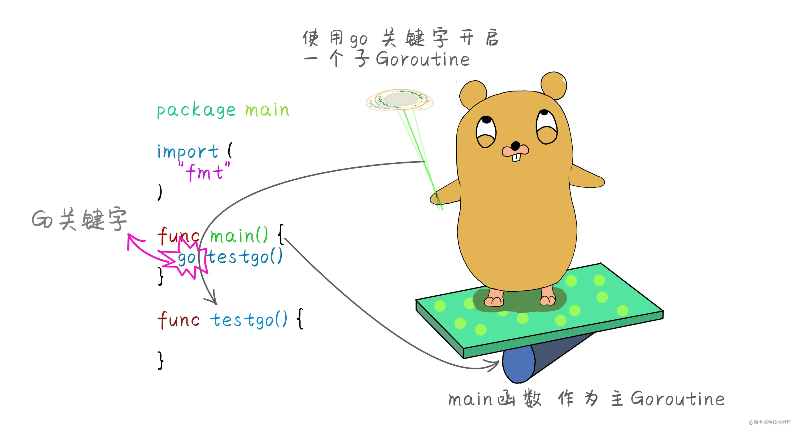
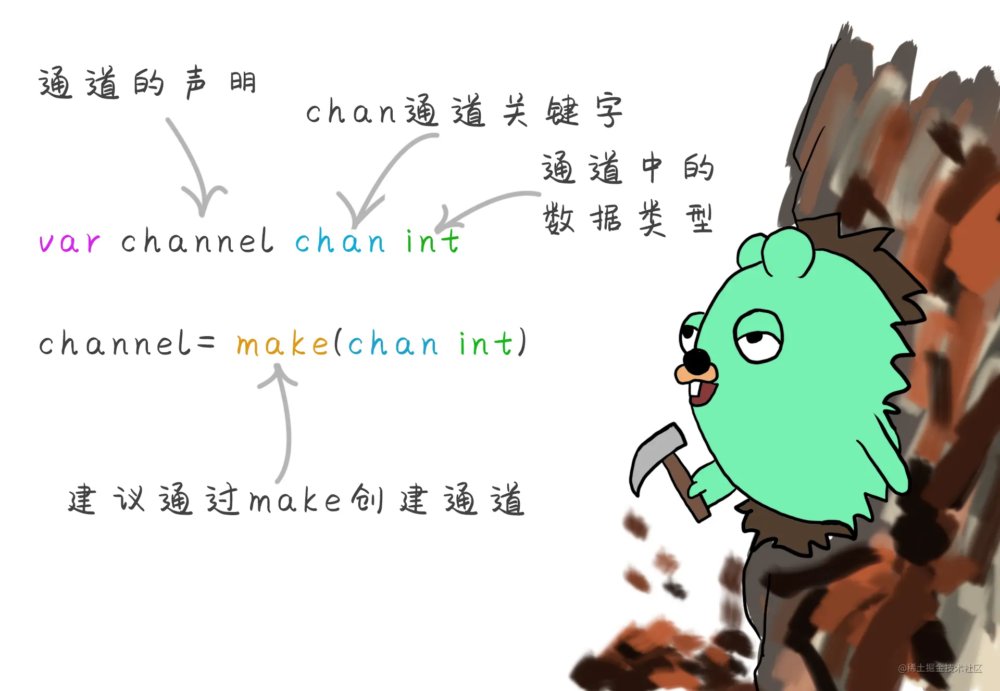
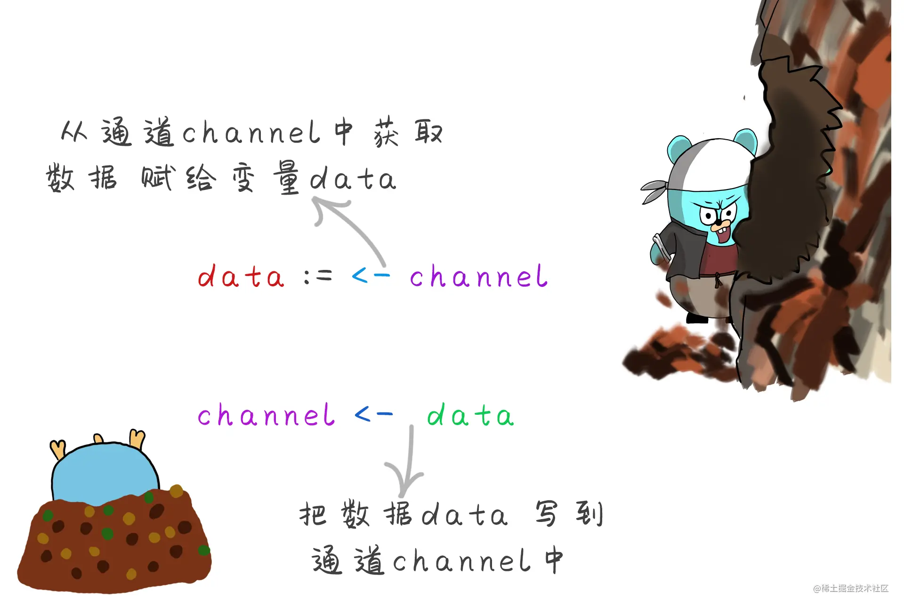
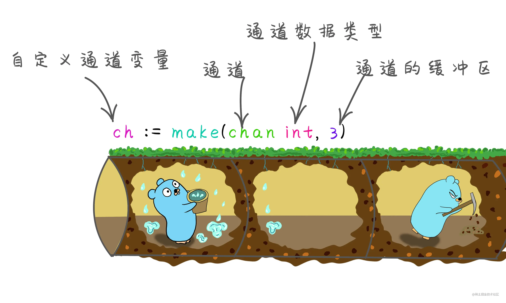

# 16_并发

> go语言的并发属于go语言中一大亮点，其他语言创建并发是通过线程，而go语言则通过协程，协程是一个轻量级的线程。进程或者线程在一台电脑中最多不能超过一万个，而协程可以在一台电脑中创建上百万个也不会影响到电脑资源。学习之前先知道一些并发与并行的一些概念。
>
> - 并发 是指在同一个时间点上只能执行同一个任务，但是因为速度非常快，所以就像同时进行一样。
> - 并行 是指在一个时间点上同时处理多个任务。真正的并行，是需要电脑硬件的支持，单核的CPU是无法达到并行的。并行，他不一定快因为并行运行时是需要通信的，这种通信的成本还是很高的，而并发的程序成本很低。
> - 进程 就是一个独立功能的程序，在一个数据集中的一次动态执行过程，可以认为他是一个正在执行的程序，比如打开一个QQ就是在运行一个进程。
> - 线程 线程是被包含在进程之中的，它是比进程更小的能独立运行的基本单位 一个进程可以包含多个线程。例如、打开文档在你输入文字的时候他还在后台检测你输入的文字的大小写，还有拼写是否正确 ，这就是一个线程来检测的。
> - 协程 协程属于一种轻量级的线程，英文名 Goroutine 协程之间的调度由 Go运行时（runtime）管理。

## Goroutine

> goroutine 协程。是go语言中特有的名词，他不同于进程Process，以及线程Thread。Go语言创造者认为和他们还是有区别的，所以创造为goroutine。goroutine与线程相比创建成本非常小，可以认为goroutine就是一小段代码，我们使用goroutine往往是执行某一个特定的任务，也就是函数或者方法。
> 使用go关键字调用这个函数开启一个goroutine时候，即使这个函数有返回值也会忽略的。所以不需要接收这个函数的返回值。



### 创建Goroutine

> 在函数或者方法前面加上关键字go，就会同时运行一个新的goroutine。类似`javascript`的`async`关键字



::: code-group

```go
package main

import "fmt"

func main() {
    go testGo()
}

// 测试协程
func testGo() {
    fmt.Println("一个协程开启了")
}
```

:::

### Goroutine怎么运行

::: info
与函数不同的是goroutine调用之后会立即返回，不会等待goroutine的执行结果，所以goroutine不会接收返回值。 把封装main函数的goroutine叫做主goroutine，main函数作为主goroutine执行，如果main函数中goroutine终止了，程序也将终止，其他的goroutine都不会再执行。
:::

::: code-group

```go
package main

import (
    "fmt"
    "time"
)

func main() {
    go testGo()
    go test2()
    fmt.Println("main函数执行完成")
    time.Sleep(1000)
}

// 测试协程
func testGo() {
    fmt.Println("一个协程开启了")
}
func test2() {
    fmt.Println("又一个协程")
}
/* 
    main函数执行完成
    一个协程开启了
    又一个协程
*/
```

:::

> 通过让主函数等待，来使子goroutine执行

### 匿名函数goroutine

::: code-group

```go
package main

import (
    "fmt"
    "time"
)

func main() {
    go testGo()
    go test2()
    go func() {
        fmt.Println("又又一个协程")
    }()
    fmt.Println("main函数执行完成")
    time.Sleep(1000)
}

// 测试协程
func testGo() {
    fmt.Println("一个协程开启了")
}
func test2() {
    fmt.Println("又一个协程")
}

/*
    main函数执行完成
    一个协程开启了
    又一个协程
    又又一个协程
*/
```

:::

### runtime包

> 虽然说Go编译器将Go的代码编译成本地可执行代码。不需要像java或者.net那样的语言需要一个虚拟机来运行，但其实go是运行在runtime调度器上的，它主要负责内存管理、垃圾回收、栈处理等等。也包含了Go运行时系统交互的操作，控制goroutine的操作，Go程序的调度器可以很合理的分配CPU资源给每一个任务。
> Go1.5版本之前默认是单核执行的。从1.5之后使用可以通过runtime.GOMAXPROCS()来设置让程序并发执行，提高CPU的利用率。

`runtime.GOROOT()`
> 获取当前goroot目录

`runtime.GOOS`
> 获取当前操作系统

`runtime.NumCPU()`
> 获取逻辑cpu数量

`runtime.GOMAXPROCS(n)`
> 设置最大的可执行cpu数,一般在程序执行前设置好在`init`函数中指定

`runtime.Goexit()`
> 如果调用runtime.Goexit()函数之后，会立即停止当前goroutine，其他的goroutine不会受影响。并且当前goroutine如果有未执行的defer 还是会执行完defer 操作。需要注意的是 **不能** 将runtime.goexit() 放在主goroutine也就是main函数中执行，否则会发生运行时恐慌。

::: code-group

```go
package main

import (
    "fmt"
    "runtime"
    "time"
)

func init() {
    fmt.Println("获取当前goroot目录", runtime.GOROOT()) // D:\Go
    fmt.Println("获取当前操作系统", runtime.GOOS)         // windows
    fmt.Println("获取逻辑cpu数量", runtime.NumCPU())    // 8
    // 设置最大的可执行cpu数,取最大数
    n := runtime.GOMAXPROCS(runtime.NumCPU())
    fmt.Println(n)
}
func main() {
    go func() {
        // 关闭协程
        runtime.Goexit()
        fmt.Println("又又一个协程")
    }()
    fmt.Println("main函数执行完成")
    time.Sleep(1000)
}
/* 获取当前goroot目录 D:\Go
获取当前操作系统 windows
获取逻辑cpu数量 8
8
main函数执行完成 */
```

:::

### 临界资源

> 指并发环境中多个协程之间的共享资源，如果对临界资源处理不当，往往会导致数据不一致的情况。例如：多个goroutine在访问同一个数据资源的时候，其中一个修改了数据，另一个goroutine在使用的时候就不对了。

::: code-group

```go
package main

import (
    "fmt"
    "math/rand"
    "time"
)

// 定义全局变量 表示救济粮食总量
var food = 10

func main() {
    //开启4个协程抢粮食
    go Relief("灾民1")
    go Relief("灾民2")
    go Relief("灾民3")
    go Relief("灾民4")

    //让程序休息5秒等待所有子协程执行完毕
    time.Sleep(5 * time.Second)
}

// 定义一个发放的方法
func Relief(name string) {
    for {
        if food > 0 { //此时有可能第二个goroutine访问的时候 第一个goroutine还未执行完 所以条件也成立
            time.Sleep(time.Duration(rand.Intn(1000)) * time.Millisecond) //随机休眠时间
            food--
            fmt.Println(name, "抢到救济粮 ，还剩下", food, "个")
        } else {
            fmt.Println(name, "别抢了 没有粮食了。")
            break
        }
    }
}

// 灾民3 抢到救济粮 ，还剩下 9 个
// 灾民4 抢到救济粮 ，还剩下 8 个
// 灾民3 抢到救济粮 ，还剩下 7 个
// 灾民4 抢到救济粮 ，还剩下 6 个
// 灾民3 抢到救济粮 ，还剩下 5 个
// 灾民2 抢到救济粮 ，还剩下 4 个
// 灾民1 抢到救济粮 ，还剩下 3 个
// 灾民4 抢到救济粮 ，还剩下 2 个
// 灾民3 抢到救济粮 ，还剩下 1 个
// 灾民2 抢到救济粮 ，还剩下 0 个
// 灾民2 别抢了 没有粮食了。
// 灾民3 抢到救济粮 ，还剩下 -1 个
// 灾民3 别抢了 没有粮食了。
// 灾民4 抢到救济粮 ，还剩下 -2 个
// 灾民4 别抢了 没有粮食了。
// 灾民1 抢到救济粮 ，还剩下 -3 个
// 灾民1 别抢了 没有粮食了。
```

:::

> 以上代码出现负数的情况，也是因为Go语言的并发走的太快了，当有一个协程进入执行的时候还没来得及取出数据，另外一个协程也进来了，所以会出现负数的情况，那么如何解决这样的问题，我们不能用休眠的方法让程序等待，因为你并不知道程序会多久执行结束，到底应该让程序休眠多长时间。下面看看如何控制goroutine协程在执行过程中保证数据的安全

### Sync同步包

> sync同步包，是Go语言提供的内置同步操作，保证数据统一的一些方法，WaitGroup 等待一个goroutine的集合执行完成，也叫同步等待组，使用Add()方法，来设置要等待一组goroutine 要执行的数量。用Done()方法来减去执行goroutine集合的数量。使用Wait() 方法让主goroutine也就是main函数进入阻塞状态，等待其他的子goroutine执行结束后，main函数才会解除阻塞状态。

::: code-group

```go
package main

import (
    "fmt"
    "math/rand"
    "sync"
    "time"
)

// 定义全局变量 表示救济粮食总量
var food = 10

// 定义一个同步等待组的对象
var wg sync.WaitGroup

func main() {
    // 指定同步等待组的数量
    wg.Add(1)
    //开启4个协程抢粮食
    go Relief("灾民1")
    go Relief("灾民2")
    go Relief("灾民3")
    go Relief("灾民4")
    // 阻塞主函数
    defer wg.Wait()
}

// 定义一个发放的方法
func Relief(name string) {
    for {
        if food > 0 { //此时有可能第二个goroutine访问的时候 第一个goroutine还未执行完 所以条件也成立
            time.Sleep(time.Duration(rand.Intn(1000)) * time.Millisecond) //随机休眠时间
            food--
            fmt.Println(name, "抢到救济粮 ，还剩下", food, "个")
        } else {
            fmt.Println(name, "别抢了 没有粮食了。")
            break
        }
    }
    // 一个执行组完成，推荐使用延时defer
    defer wg.Done()
}

// 灾民3 抢到救济粮 ，还剩下 9 个
// 灾民4 抢到救济粮 ，还剩下 8 个
// 灾民3 抢到救济粮 ，还剩下 7 个
// 灾民4 抢到救济粮 ，还剩下 6 个
// 灾民3 抢到救济粮 ，还剩下 5 个
// 灾民2 抢到救济粮 ，还剩下 4 个
// 灾民1 抢到救济粮 ，还剩下 3 个
// 灾民4 抢到救济粮 ，还剩下 2 个
// 灾民3 抢到救济粮 ，还剩下 1 个
// 灾民2 抢到救济粮 ，还剩下 0 个
// 灾民2 别抢了 没有粮食了。
```

:::

### 锁

> 在并发编程中存在多个goroutine协程共用同一条数据，也就是临界资源的安全问题，为了解决这种的问题Go语言提供了同步等待组的方法解决，Go语言还提供了锁，控制并发情况下的数据安全。Go语言提供两种锁类型互斥锁和读写锁。当一个协程在访问当前数据资源的时候，给当前资源加上锁， 防止另外的协程访问，等待解锁后其他协程才能够访问。

#### 互斥锁

> 互斥锁，当一个goroutine获得锁之后其他的就只能等待当前goroutine执行完成之后解锁后才能访问资源。对应的方法有上锁Lock()和解锁Unlock()。

::: code-group

```go
package main

import (
    "fmt"
    "sync"
)

//定义全局变量 表示救济粮食总量
var food = 10

//同步等到组对象
var wg sync.WaitGroup

//创建一把锁
var mutex sync.Mutex

func main() {
    wg.Add(4)
    //开启4个协程抢粮食
    go Relief("灾民好家伙")
    go Relief("灾民好家伙2")
    go Relief("灾民老李头")
    go Relief("灾民老李头2")
    wg.Wait() //阻塞主协程，等待子协程执行结束
}

//定义一个发放的方法
func Relief(name string) {
    defer wg.Done()
    for {
        //上锁
        mutex.Lock()
        if food > 0 { //加锁控制之后每次只允许一个协程进来，就会避免争抢
            food--
            fmt.Println(name, "抢到救济粮 ，还剩下", food, "个")
        } else {
            mutex.Unlock() //条件不满足也需要解锁 否则就会造成死锁其他不能执行
            fmt.Println(name, "别抢了 没有粮食了。")
            break
        }
        //执行结束解锁，让其他协程也能够进来执行
        mutex.Unlock()
    }
}

```

:::

::: info
在使用互斥锁的时候一定要进行解锁,否则会造成程序的死锁
:::

#### 读写锁

> 互斥锁是用来控制多个协程在访问同一个资源的时候进行加锁控制,保证了数据安全，但同时也降低了性能，如果说多个goroutine同时访问一个数据，只是读取一下数据，并没有对数据进行任何修改操作，那么不管多少个goroutine来读取都应该是可以的。主要问题在于修改。修改的数据就需要加锁操作，来保证数据在多个goroutine读取的时候统一。 读取和读取之间是不需要互斥操作的，所以我们用读写锁专门针对读操作和写操作的互斥锁。

::: code-group

```go
package main

import (
    "fmt"
    "math/rand"
    "sync"
    "time"
)

// 定义全局变量 表示救济粮食总量
var food = 10

// 定义一个同步等待组的对象
var wg sync.WaitGroup

// 创建一个锁
var mutex sync.Mutex

// 创建一个读写锁
var rwmut sync.RWMutex

func main() {
    wg.Add(5)
    go write()
    go read()
    go read()
    go read()
    go write()
    wg.Wait()
}

// 写
func write() {
    rwmut.Lock()
    fmt.Println("写")
    food += 1
    wg.Done()
    defer rwmut.Unlock()
}

// 读
func read() {
    rwmut.Lock()
    fmt.Println("读", food)
    wg.Done()
    defer rwmut.Unlock()
}

// 写
// 读 11
// 写
// 读 12
// 读 12
```

:::

::: info
与普通的互斥锁的区别在于他能分别针对读操作和写操作进行锁定和解锁。读写锁的控制规则是，他允许任意多个读操作同时进行，但是只允许一个写操作进行，并且在某一个写操作的时候不允许读操作进行。
:::

## channel

> channel通道是用来实现多个协程 Goroutines之间的通讯的，通道相当于一个管道，管道里面放的是数据, 管道一头放 则另一头取。Go语言虽然提供了传统的同步机制，但是Go语言强烈建议还是使用通道来实现Goroutines之间的通讯。Go语言强调 "不要通过共享内存来通信，而应该通过通信来共享内存"
> 当存在多个goroutine要传递某一个数据时，可以把这个数据封装成一个对象，然后把对象的指针传入channel通道中，另一个goroutine 从通道中读取这个指针。同一时间只允许一个goroutine访问channel通道里面的数据。所以go就是把数据放在了通道中来传递，而不是共享内存来传递。

### 声明

> 每个通道都有与其相关的类型，该类型表示通道中允许传递的数据类型,通道作为一种`引用`数据类型也有自己的默认值零值为nil, 通道必须使用类似于切片的方法 make()来定义声明通道。



### 使用



> 不管是发送数据还是获取数据， 他们都是阻塞的，当一个goroutine 向另一个goroutine发送数据的时候，他就是阻塞的，直到有另外一个goroutine来取数据，则解除阻塞。相反的 读取数据也是阻塞的，直到另一个goroutine向他来写数据来解除阻塞。channel 本身就是同步的。也就是同一时间只允许一条goroutine来操作。要使用通道最少有两个goroutine来操作。一个goroutine是用不到channel的。

::: code-group

```go
package main

import (
    "fmt"
    "sync"
    "time"
)

var wg sync.WaitGroup

func main() {
    wg.Add(2)
    go receive()
    go send()
    wg.Wait()
}

var channel = make(chan int)

func send() {
    time.Sleep(1 * time.Second)
    fmt.Println("开始发送")
    channel <- 122
    defer wg.Done()

}
func receive() {
    // 接收数据
    fmt.Println("heiheihie")
    data := <-channel
    fmt.Println("接收数据", data)
    defer wg.Done()
}

// heiheihie
// 开始发送
// 接收数据 122
```

:::
> 通过通道来传输数据的时候，读写操作必须是一一对应的，也就是说，有一个读的操作必须对应的有一个写的操作，否则程序会阻塞,造成程序死锁。

### 通道关闭

> 当发送者或者接收者把数据发生完毕，发送者可以关闭通道，通知接收方不会再有数据发送到channel上了然后发送方调用 `close()`函数关闭通道。接收者可以获取来自通道数据时候额外的变量，来检测通道是否已经关闭。

::: code-group

```go
v,ok := <- ch  //从通道获取数据时后会返回一个值v 和一个通道的状态ok 为bool类型
```

:::

::: code-group

```go
package main

import (
    "fmt"
    "sync"
    "time"
)

var wg sync.WaitGroup

func main() {
    wg.Add(2)
    go send2()
    go receive2()
    wg.Wait()
}
func send2() {
    for i := 0; i < 10; i++ {
        channel <- i
    }
    // 关闭通道
    close(channel)
    defer wg.Done()
}
func receive2() {
    for {
        v, ok := <-channel //获取通道的状态以及数据
        if !ok {
            fmt.Println("协程已将通道关闭")
            break
        }
        fmt.Println("获取到协程数据为", v)
    }
    defer wg.Done()
}
// 获取到协程数据为 0
// 获取到协程数据为 1
// 获取到协程数据为 2
// 获取到协程数据为 3
// 获取到协程数据为 4
// 获取到协程数据为 5
// 获取到协程数据为 6
// 获取到协程数据为 7
// 获取到协程数据为 8
// 获取到协程数据为 9
// 协程已将通道关闭
```

:::
> 上面代码通过for循环来访问通道的数据,可以通过for range来循环取通道中的数据。for range 就是遍历所有数据，当没有数据的时候也就循环结束。所以可以 替代 v,ok:=<-ch1

::: code-group

```go
for v := range ch1 {
}
```

:::

### 缓冲通道

> 前面的channel通道都是非缓冲通道，每一次发送和接收都是阻塞式的。一个发送操作，对应一个接收操作，如果发送后未接收，就是阻塞的。同样对于接收者来说另一个发送之前它也是阻塞的。缓冲通道指的是有一个缓冲区，对于发送数据是将数据发送到缓冲区。当缓冲区满了之后才会被阻塞。对于接收数据方，当没有数据可以接收的时候也会被阻塞。

#### 创建

> 默认情况下无缓冲区的容量都是0，所以之前创建的通道都默认容量都是0。可以在声明通道之后一个参数来指定缓冲区的大小。



::: code-group

```go
package main

import (
    "fmt"
)

func main() {
    //定义一个缓冲区大小为5的通道
    ch1 := make(chan int, 5)
    ch1 <- 1 //向缓冲区放入数据1 因为缓冲区的大小为5 放入一个1之后 还有四个空的缓冲区  所以还未阻塞
    ch1 <- 2
    ch1 <- 3
    ch1 <- 4
    ch1 <- 5 //此时缓冲区已经满 如果再加入 则会进入阻塞状态
    //继续添加时会造成死锁 因为缓冲区满了 一直没有读取
    ch1 <- 6 //fatal error: all goroutines are asleep - deadlock!
    fmt.Println("main end")
}
```

:::

> 对于缓冲区中的数据，是先进先出的原则。第一个进去的第一个被读取到，可以理解为，一个从管道的一端放入，一个从管道的另一端读取
