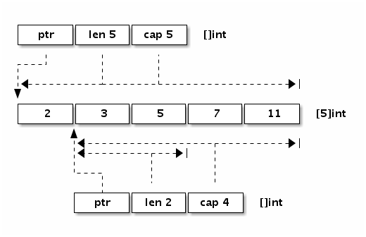

# 07_切片

切片在go语言中是比数组更加常用的数据结构,可以将其看作变长数组来使用

## 数据结构

还是先打印一个go语言切片的尺寸

```go
a := []int{1,2,3}
b := []int{1,2,3,4,5}
as := a[1:]
bs := b[:]
fmt.Println(unsafe.Sizeof(a)) // 24
fmt.Println(unsafe.Sizeof(b)) // 40
fmt.Println(unsafe.Sizeof(as)) // 24
fmt.Println(unsafe.Sizeof(bs)) // 40
```

> 可以看到,数组的尺寸和元素数量有关,但切片的尺寸始终恒定为24,我们可以推测,与字符串一致,切片的数据类型其实也是包含一个数组指针的结构体

::: code-group

```go [GoRoot/src/runtime/slice.go]
type slice struct {
    array unsafe.Pointer
    len   int
    cap   int
}
```

```go [GoRoot/src/reflect/value.go]
type SliceHeader struct {
    Data uintptr
    Len  int
    Cap  int
}
```

:::

> 上面是`slice`在`runtime`和`reflect`中的结构,与字符串不同,slice底层指向的数组是可写的,除了指向底层数组的指针和数组的长度外,它比字符串还多了一个字段cap,表示容量,它们的关系如下图：



::: info
cap就是指当前切片的起始位置到所依赖底层数组末尾的长度
:::

## 初始化

> go语言中切片初始化有三种方式
>
> 1. 使用下标
> 2. 使用字面量
> 3. 使用make

### 下标

> 使用下标创建切片是最原始也最接近汇编语言的方式，它是所有方法中最为底层的一种
>
> 通过下标引用的方式将被引用的数组或切片当作底层数组返回一个新的切片
>
> 因此它和被引用的切片/数组底层依赖的数组是一致的,一个发生了改变,另一个也会发生改变

```go
func main() {
    a := [3]int{1, 2, 3}
    b := a[1:3]
    b[1] = 4
    fmt.Println(a) // [1 2 4]
}
```

### 字面量

> 使用字面量来初始化切片

```go
func main() {
    a := []int{1, 2, 3}
    fmt.Println(a)
}
```

> 上述代码其实在编译时展开的代码大致如下

```go
var vstat [3]int
vstat[0] = 1
vstat[1] = 2
vstat[2] = 3
var vauto *[3]int = new([3]int)
*vauto = vstat
a := vauto[:]
```

> 它有如下操作
>
> 1. 根据切片中的元素数量对底层数组的大小进行推断并创建一个数组；
> 2. 将这些字面量元素存储到初始化的数组中；
> 3. 创建一个同样指向 [3]int 类型的数组指针；
> 4. 将静态存储区的数组 vstat 赋值给 vauto 指针所在的地址；
> 5. 通过 [:] 操作获取一个底层使用 vauto 的切片；
>
> 从第5步也可以看出,[:]确实是操作切片最底层的方式
>
> 使用`go build -gcflag -S`生成汇编来验证

```plan9_x86
LEAQ    type:[3]int(SB), AX // 创建长度为3的新数组
PCDATA  $1, $0
CALL    runtime.newobject(SB) // 创建切片
MOVQ    $1, (AX) // 给数组赋值
MOVQ    $2, 8(AX)
MOVQ    $3, 16(AX)
```


